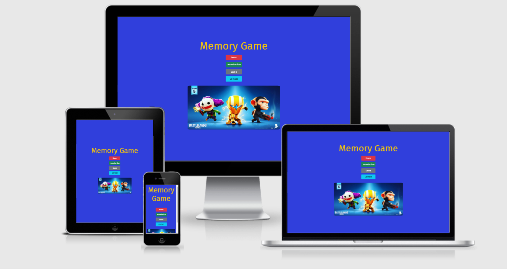
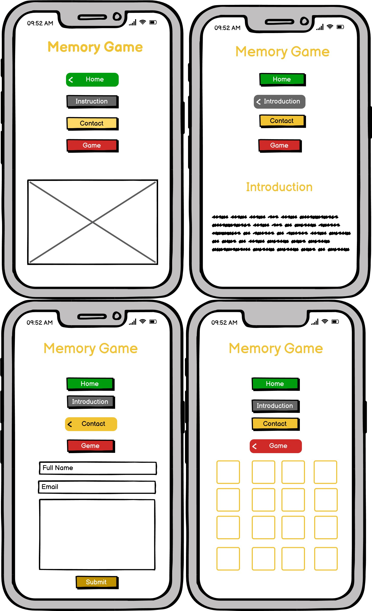
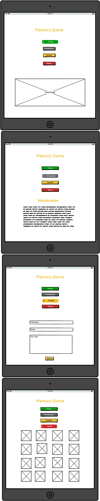
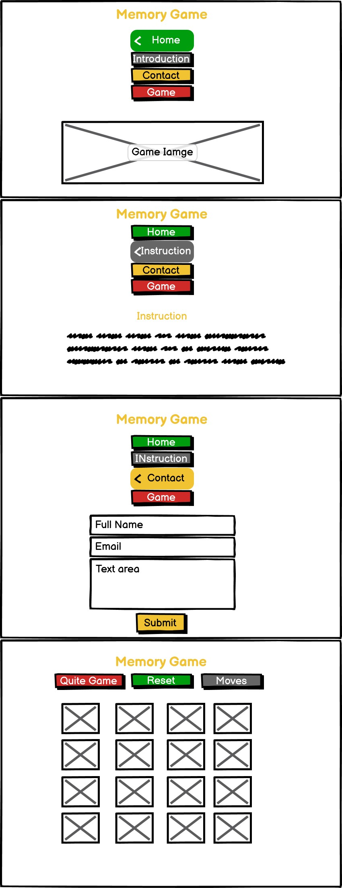

# Build-Four-Project

[Live Code](https://78istvan.github.io/Build-Four-Project/)

# Content

 [User experience UX](#user-experience)

  [User stories](#user-stories)

  [Design](#design)
 
 [Wireframes](#wireframes)

 - [Phone size wireframe](#phone-size-wireframe)
 - [Tablet size wireframe](#tablet-size-wireframe)
 - [Desktop size wireframe](#desktop-size-wireframe)

[Features](#features)

[Technologies used](#technologies-used)

[Testing](#testing)

[Deployment](#deployment)

[Credits](#credits)

# User experience
 
 ## User stories

 - First time visitors
 - Returning visitors
 - Frequen user

 ## Design

## Wireframes

Wireframes are availabe in tree sizes phone, tablet, and desktop size.
### Phone size wireframe

### Tablet size wireframe

### Desktop size wireframe

# Features

# Technologies used

## Languages used
## Frameworks, Libraties, and Programs used

# Testing

# Deployment 

## GitHub Pages

## Forking the github repository

## making local clone

# Credits

## Code

## Content

## Media

## Acknowledgements