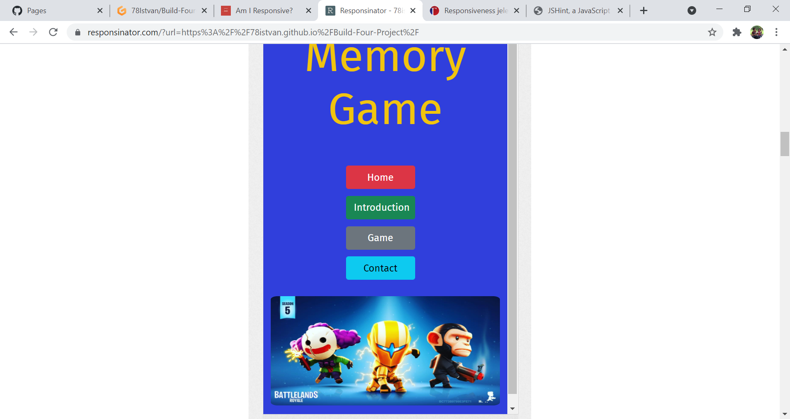

# Build-Four-Project 

## Memory Game


[Live Code](https://78istvan.github.io/Build-Four-Project/)

# Table of Content

1. [User experience UX](#user-experience)

- [User stories](#user-stories)

2. [Design](#design)

* [Color](#colors)

* [Styling](#styling)
 
3. [Wireframes](#wireframes)

 - [Phone size wireframe](#phone-size-wireframe)
 - [Tablet size wireframe](#tablet-size-wireframe)
 - [Desktop size wireframe](#desktop-size-wireframe)

4. [Features](#features)

5. [Technologies used](#technologies-used)

* [Languages used](#languages-used)

* [Frameworks, Libraries & Programs Used](#frameworks-libraries-&-programs-used)

6. [Testing](#testing)

* [Manual Testing](#manual-testing)

* [Functionality Testing](#functionality-testing)

* [Code Validation](#code-validation)

* [Performance Testing](#performance-testing)

  * [End of the game pop up message testing](#end-of-the-game-pop-up-message-testing)

  * [Known bug and solving](#known-bug-and-solving)


7. [Deployment](#deployment)

* [Deploy Memory Game](#deploy-memory-game)

* [How to run this project locally](#how-to-run-thi-project-locally)

8. [Credits](#credits)

* [Media](#media)

* [Content](#content)

* [Acknowledgements](#acknowledgements)

# User experience
 
 ## User stories

 ### Project goal

   The main goal of this project to build a memory game to spend some enjoyable 
   time, and to give a user an attractive game board with clear images and bright colors. The images downloaded to the project with study pourpose only and 
    they are belonging to the Battlelend online mobile game owner or company.
  

 #### User Stories

 ##### As a developer I want

- A memory game with lots of colors and very easy functioning

- Use all my knowledge about the languages I learnd so far, such as Javascript, jQuey, HTML and CSS.

- This game made for fun reason, so there is no loose option in the game, even if there is a timer and moves counter, te player can't loose the game
  
- A memory game to play to relax and no pressure, with enjoyable images and easy functioning, however there is an option to competit with our selfe to check timer and counter serults.


##### As the user I want

- A nice and cool looking game board with attractive images.

- An application form to write my experiance about the page and the game.

- A short instruction about the game usage.

- To play on multiple devices.

- To see my moves and time to compare and a popup message on the end of the game levels.

- To reset and start the game anytime.

 

 ## Design

 ### Colors

 - The colors have been used from an online tablet game main colors called Battleland, so the two basic colors
 are yellow for text [HEX #F1C40F](https://www.google.com/search?q=%23F1C40F&rlz=1C1GCEA_enIE925IE925&oq=%23F1C40F&aqs=chrome..69i57j0i30l9.3173j0j4&sourceid=chrome&ie=UTF-8) 
 and the blue for background [HEX #303FDC](https://www.google.com/search?q=%23303FDC&rlz=1C1GCEA_enIE925IE925&oq=%23303FDC&aqs=chrome..69i57.4893j0j9&sourceid=chrome&ie=UTF-8) 

 ### Styling 

 - font used: [google font](https://fonts.google.com/specimen/Fira+Sans)

 - images used: The images are from the Battleland online tablet game for study purpose only.
    
 - buttons used: the classic [bootstrap button](https://getbootstrap.com/docs/5.0/components/buttons/) colors

 [Back To Table of content](#table-of-content)

## Wireframes

Wireframes are availabe in tree sizes phone, tablet, and desktop size.
### Phone size wireframe


### Tablet size wireframe


### Desktop size wireframe

  

[Back To Table of content](#table-of-content)

# Features

- There are three levels built in the game to keep the user more excited, with a popup message on the end of every level, where the player can choose to step to the next stage.

- During the game a built-  in counter counting the player movements and the time counter checking the time.

- End of the levels a popup message shows the player a result about the number of movements, and the time, so the player can make a little competition to solve the game faster or with less moves.

* The utilized images and colours are very simple and colorful to give the user a nice and happy feeling so they encourage the player
  to stick to the game and use them memory skills to solve the game again.

* Very easy and simple usage with nice colorful big buttons.


* A nice and elegant title of the game to tell what is the page about it.


* An introduction text about the game.


* An active counter and timer buttons 


* A contact form to get contact with the game owner.


* A big and easy to use game board


[Back To Table of content](#table-of-content)

# Technologies used

## Languages used 

* HTML5
* CSS3
* JavaScript

## Frameworks, Libraries & Programs Used

*  [Bootstrap 5.0.0](https://getbootstrap.com/docs/5.0/getting-started/introduction/)
  * Bootstrap was used to assist with the responsiveness and styling of the website.
* [Git](https://gitpod.io/workspaces/)
  * Git was used for version control by utilizing the Gitpod terminal to commit to Git and Push to GitHub.
* [GitHub](https://github.com/)
  * GitHub is used to store the projects code after being pushed from Git.
* [Balsamiq](https://balsamiq.com/wireframes/?gclid=Cj0KCQjw0caCBhCIARIsAGAfuMww-ltoyDwB6ZrAlyHF7kvDAEL_HD6_6Wdy3yEckSbSgu3D-SvI5QcaAthnEALw_wcB)
  * Balsamiq was used to create the wireframes during the design process.
* [jQuery](https://jquery.com/) 
  * jQuery was used in the game JavaScript code

[Back To Table of content](#table-of-content)

# Testing


## Manual Testing

* The game has four main buttons linked to four different pages have been tested 
  during the work with the project to ensure they are linked correctly.

*  There is a move counter in the game shows the player how many moves needed to solve the game,
   and there is a time counter also to give a result to the player that how long it took.
   The timer is keep going untill the player clicks the last card.
   The player can't run out of time', can't loose the game, player can competit with his/her selfe to solve the game again
   faster and faster time to time.
     

* Game moves counter tested and checked while game play, increment the numbers after every clicks.

* Pop up message appear on the end of every game level.

* Reset button shuffles the cards any time it has been pressed.

* The main thing of the project is the game, have been tested multiple times
  by family members and my own self on different devices.

## Functionality Testing 

* I used Google Chrome Development Tools to during the whole process to debug, fix, and modify codes.

## Responsive testing

* The project responsiveness tested on the  [Am I Responsive?](http://ami.responsivedesign.is/) and the [Responsinator](https://www.responsinator.com/) websites and also tested during the project process in Google Chrome tool.

   * Am I Responsive screenshot

   

   * Responsinator screenshots

   1. Android 412px

   

   2. iPhone8 375px

    

    3. iPad 768px

    

## Code Validation

1.  [W3C Markup Validator](https://jigsaw.w3.org/css-validator/)

    

  * Bootstrap 5 couse some errors in validation, probably because some missing up dates in validator.

 2. [W3C HTML Validator](https://validator.w3.org/nu/)

- Home page

- Introduction page

- Game page

- Contact page


3. [JSHint testing](https://jshint.com/)

CONFIGURE
Metrics
There are 17 functions in this file.

Function with the largest signature take 1 arguments, while the median is 0.

Largest function has 13 statements in it, while the median is 4.

The most complex function has a cyclomatic complexity value of 5 while the median is 1.

29 warnings
12	'let' is available in ES6 (use 'esversion: 6') or Mozilla JS extensions (use moz).
29	Missing semicolon.
32	'let' is available in ES6 (use 'esversion: 6') or Mozilla JS extensions (use moz).
34	Expected an assignment or function call and instead saw an expression.
35	'let' is available in ES6 (use 'esversion: 6') or Mozilla JS extensions (use moz).
53	'let' is available in ES6 (use 'esversion: 6') or Mozilla JS extensions (use moz).
53	'spread operator' is only available in ES6 (use 'esversion: 6').
54	'let' is available in ES6 (use 'esversion: 6') or Mozilla JS extensions (use moz).
55	'const' is available in ES6 (use 'esversion: 6') or Mozilla JS extensions (use moz).
56	'destructuring assignment' is available in ES6 (use 'esversion: 6') or Mozilla JS extensions (use moz).
62	'let' is available in ES6 (use 'esversion: 6') or Mozilla JS extensions (use moz).
66	'arrow function syntax (=>)' is only available in ES6 (use 'esversion: 6').
72	Expected an assignment or function call and instead saw an expression.
80	['source'] is better written in dot notation.
81	Missing semicolon.
84	['source'] is better written in dot notation.
97	Expected an assignment or function call and instead saw an expression.
98	Missing semicolon.
105	'let' is available in ES6 (use 'esversion: 6') or Mozilla JS extensions (use moz).
112	'let' is available in ES6 (use 'esversion: 6') or Mozilla JS extensions (use moz).
114	'arrow function syntax (=>)' is only available in ES6 (use 'esversion: 6').
145	Expected an assignment or function call and instead saw an expression.
150	Missing semicolon.
151	Expected an assignment or function call and instead saw an expression.
151	Missing semicolon.
152	'let' is available in ES6 (use 'esversion: 6') or Mozilla JS extensions (use moz).
157	'let' is available in ES6 (use 'esversion: 6') or Mozilla JS extensions (use moz).
161	Missing semicolon.
165	Missing semicolon.
Two undefined variables
75	$
105	$
112	$
113	$
123	$
128	$
142	$
143	$
144	$
145	$
145	$
152	$
157	$
158	$
159	$
168	$
136	setTimer
166	setTimer
One unused variable
156	closeModal


## Performance Testing

- Use Lighthouse tool for testing

### Chrome Light House Screenshot 


### End of the game pop up message testing 

* I changed numberOfPairs variable from 8 to 1 during pop up message testing to make 
the testing easier. This technic saved me a lot of time, because I did not have to solve the full game 
every time I tested the pop up window, because I had only 1 pair in my card table.

### Known bug and solving

* The used CSS for flipping card didn't work on Safari Browser and Mozzilla Fire Fox so I had to 
find what CSS can solve my problem.
 
  * The first used Css code

```
.card {
    margin: 5px;
    position: relative;
    transform: scale(1);
    transform-style: preserve-3d;
    transition: transform .5s;
    width: 21%;
    
   
}
.front-card {
    position: relative;
    backface-visibility: hidden;
    transform: rotateY(180deg);
    width: 100%;
    height: 100%;
    
   
    
}
.back-card {
    width: 100%;
    height: 100%;
    position: absolute;
    backface-visibility: hidden;
    
}
```
  * Code used to fix the problem 

```
.card {
    margin: 5px;
    position: relative;
    transform: scale(1);
    transform-style: preserve-3d;
    transition: transform .5s;  
    width: 21%;
    background-color: transparent;
   
}
.front-card {
    position: relative;
    backface-visibility: hidden;
    transform: rotateY(180deg);
    width: 100%;
    height: 100%;
    -webkit-backface-visibility: hidden;
    
}
.back-card {
    width: 100%;
    height: 100%;
    position: absolute;
    backface-visibility: hidden;
    -webkit-backface-visibility: hidden;
}

```
   The difference is only the last line in all of the classes, but they 
solved me a big bug in my project.

[Back To Table of content](#table-of-content)

# Deployment 

### Deploy Memory Game

To deploy Memory Game to GitHub Pages from its [repo](https://github.com/78Istvan/Build-Four-Project) these are the steps to take.

1. Log in to GitHub and locate the GitHub Repository.
2. From the list of repos choose 78Istvan/Build-Four-Project
3. Near the top of the page there will be the menu items, click on Settings
4. On the left side of the screen there is another list of items.
5. Scroll down to the second last item which will be Pages and select it.
6. Under Source click the dropdown menu and select Master
7. Once selected the link will appear in a matter of seconds to the live site.

[The live site address]( https://78istvan.github.io/Build-Four-Project/)

### How to run this project locally

#### To clone this project:

1. Click this link to the [Memory Game](https://github.com/78Istvan/Build-Four-Project) repo.
2. Under the menu items, there is a green button labelled Code.
3. Click the Code button and under the Clone option select the HTTPS tab.
4. Copy the clone URL for the repo.
5. In Your IDE open Git
6. Change the current directory to the location you want to clone this repo.
7. Type git clone followed by the copied URL.
8. Press Enter and your clone will be created.

[Back To Table of content](#table-of-content)

# Credits

## Media

* Images belonging to the Battlelands mobile game, after google search I downloaded 
  them to use in my memory game for study purpose only.

## Code

* The Css and HTML code was written by the developer.

* Some JavaScript ideas and inspiration was taken from Marina Ferreira`s [YouTube video](https://www.youtube.com/watch?v=ZniVgo8U7ek)

* [W3school](https://www.w3schools.com/js/) was used to get more understanding about javaScrip usage.

* [Stack Overflow](https://stackoverflow.com/)helped to find the solutin of css effects, bootstrap default code overwright problems.


## Content

* All text was written by Istvan Juhasz

## Acknowledgements

* My mentor support, and advise

* Slack students help with advises how to fix bugs

* My family, especially my kids support of live testing the game, and give me a very honest feedback about liked and unliked things in the game.

[Back To Table of content](#table-of-content)


